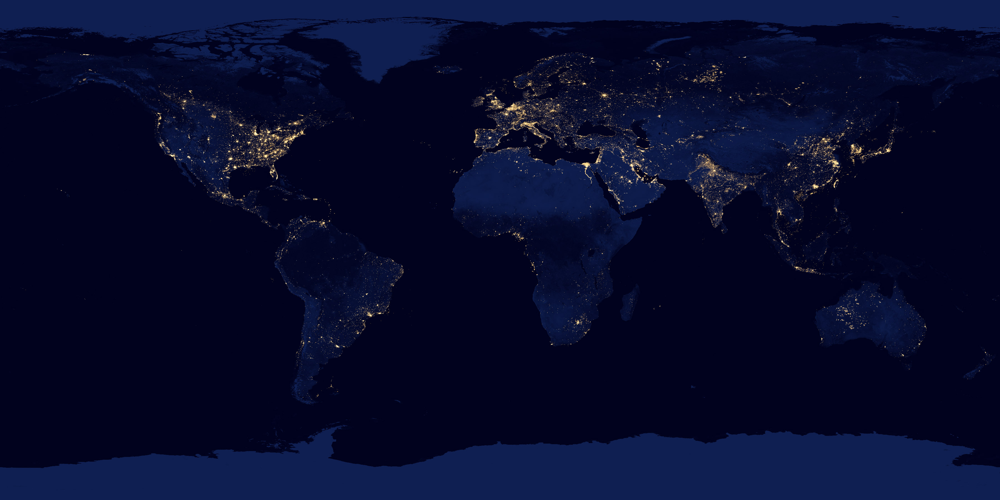
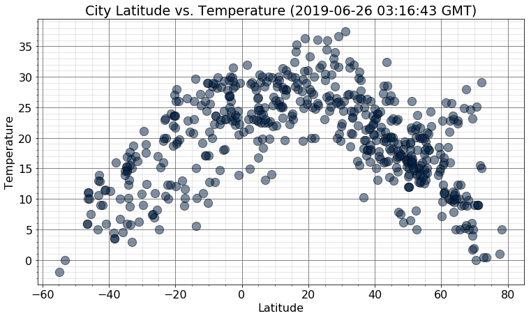
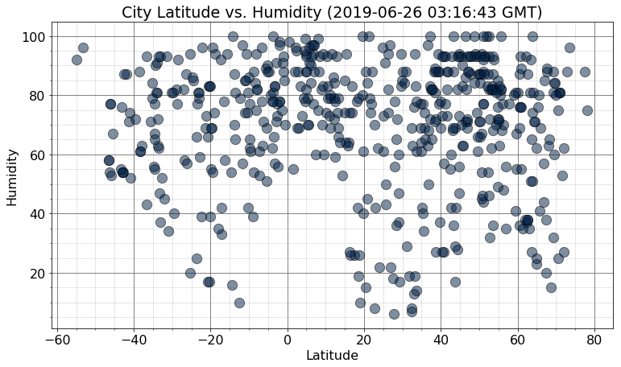
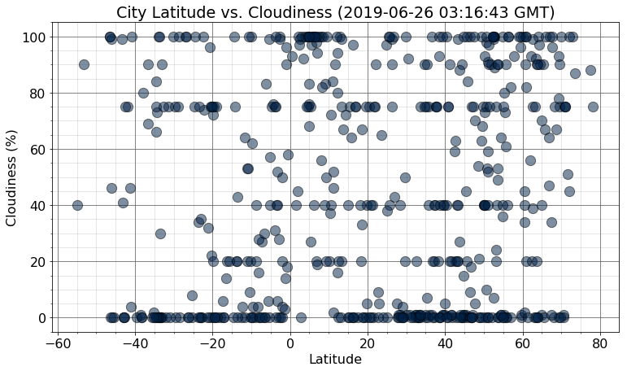
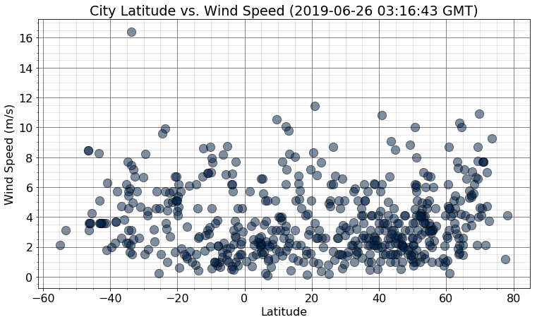
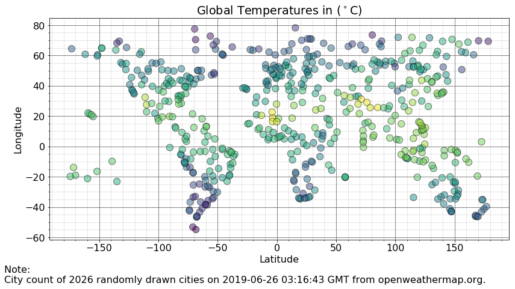
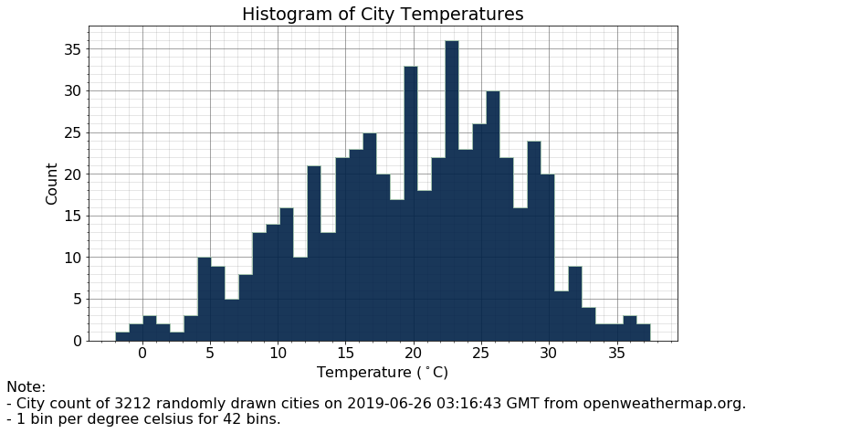
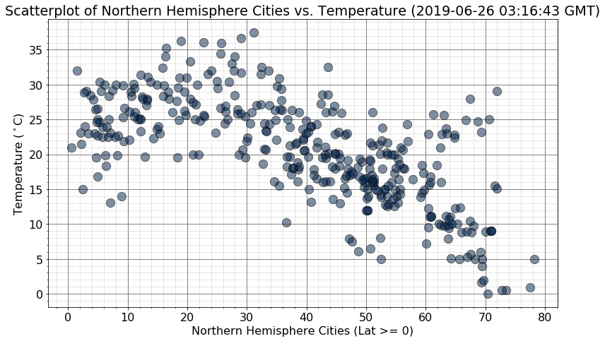
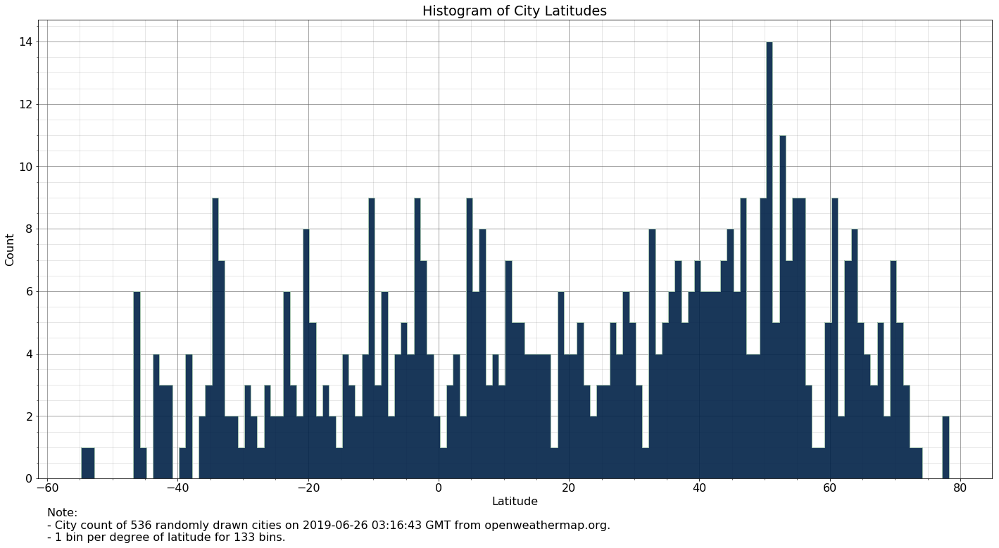

```python
from IPython.display import Image
Image(filename = 'lights_at_night.jpg', width = 2000, height = 2000)
```





<h1><center> WeatherPy - Homework 6 - API</center></h1>

#### 3 Observed Trends

* Latitude affects temperature: It is common sense that as you get closer to the equator the temperature will rise.  This is clearly shown in the Latitude vs. Temperature graph with the curvlinear relationship demonstrating the change in temperature for cities with high and low latitudes.

* It appears that Latitude and Cloudiness are independent of each other.  There is no discernable relationship between Latitude and Cloudiness shown in Plot 3, with cities of varying Latitude showing varying values of Cloudiness.

* Most of the randomly selected 3000+ cities 


which represent a 1% sample of the 202,000 cities with collectable data available through openweathermap.org,


#### Environment Setup


```python
# Dependencies and Setup
import matplotlib.pyplot as plt
import pandas as pd
import numpy as np
import json
from requests import get
from time import sleep
from pprint import pprint
from config import api_key
from datetime import datetime
```

#### Generate 500+ Random City Names


```python
#
# This code cell was provided as starter code
#

# Incorporated citipy to determine city based on latitude and longitude
from citipy import citipy

# Output File (CSV)
output_data_file = "output_data/cities.csv"

# Range of latitudes and longitudes
lat_range = (-90, 90)
lng_range = (-180, 180)

# List for holding lat_lngs and cities
lat_lngs = []
cities = []

# Create a set of random lat and lng combinations
lats = np.random.uniform(low = -90.000, high = 90.000, size = 1500) # Adjust the size for more cities
lngs = np.random.uniform(low = -180.000, high = 180.000, size = 1500) # Adjust the size for more cities

lat_lngs = zip(lats, lngs)

# Identify nearest city for each lat, lng combination
for lat_lng in lat_lngs:
    
    city = citipy.nearest_city(lat_lng[0], lat_lng[1]).city_name
    
    # If the city is unique, then add it to a our cities list
    if city not in cities:
        cities.append(city)
```

#### Initalize needed objects for API calls


```python
# Setup the cities iterator
city_list = [str(i) for i in cities]

# Initialize needed objects
city_count = 0
city_data = pd.DataFrame()
```

#### API Call
###### Note: This takes approximately 10 to 15 minutes


```python
# For loop through the cities iterator, pulling needed data from the JSON request object
for city in city_list:
    
    # Get JSON response file for each city
    response = get('http://api.openweathermap.org/data/2.5/weather?q='
                   + city
                   + '&APPID='
                   + api_key 
                   + '&units=metric').json()
    
    # Pause for 1.175 seconds (70.5 seconds for 60 requests) 
    # to ensure compliance with request rate of 60 calls per minute
    sleep(1.175)
    
    try:
        
        # Test response code of JSON file for cities not found
        if response['cod'] == 200:
            
            # Pull needed data from JSON response object and insert into a dictionary
            city_dict = {
                'city_id': response['id'],
                'name': response['name'],
                'country': response['sys']['country'],
                'longitude': response['coord']['lon'],
                'latitude': response['coord']['lat'],
                'cloudiness': response['clouds']['all'],
                'humidity': response['main']['humidity'],
                'temperature': response['main']['temp'],
                'wind_speed': response['wind']['speed'],
                'time': response['dt']
            }
        
            # Create a temporary single row dataframe with the current cities data
            temp_df = pd.DataFrame(city_dict, index = ['city']).set_index('city_id')  
        
            # Add the temporary dataframe row to the pre-intialized city_data DataFrame
            city_data = pd.concat([city_data, temp_df])
        
            # Add 1 for each city iteration to the city counter
            city_count += 1
        
            # Collect the current cities name
            city_name = city_dict['name']    
            
            # Re-intialise the city dictionary to be empty for the next interation
            city_dict = {}
            
        else:
            
            print('City not found ... skipping.')
    
    # Raise a KeyError if a cities JSON response does not include all of the needed data
    except KeyError as e:
        
        print(f'Skipping city ... : KeyError: {e} not found.') 
    
    print(f'Accessing city # {city_count} | {city_name}')
```

    Accessing city # 1 | Bubaque
    Accessing city # 2 | Barsi
    Accessing city # 3 | Ponta Delgada
    Accessing city # 4 | Biak
    Accessing city # 5 | Atherton
    Accessing city # 6 | Vaini
    Accessing city # 7 | Mataura
    Accessing city # 8 | Waingapu
    Accessing city # 9 | Ancud
    Accessing city # 10 | Hermanus
    Accessing city # 11 | Thika
    Accessing city # 12 | Rafraf
    Accessing city # 13 | Yabelo
    Accessing city # 14 | Makakilo City
    Accessing city # 15 | Kapaa
    City not found ... skipping.
    Accessing city # 15 | Kapaa
    Accessing city # 16 | Isangel
    Accessing city # 17 | Sechura
    Accessing city # 18 | Hithadhoo
    Accessing city # 19 | Qostanay
    Accessing city # 20 | Punta Arenas
    City not found ... skipping.
    Accessing city # 20 | Punta Arenas
    City not found ... skipping.
    Accessing city # 20 | Punta Arenas
    Accessing city # 21 | Ushuaia
    Accessing city # 22 | Ponta do Sol
    Accessing city # 23 | Turayf
    City not found ... skipping.
    Accessing city # 23 | Turayf
    Accessing city # 24 | Castro
    Accessing city # 25 | Bandundu
    Accessing city # 26 | Charters Towers
    Accessing city # 27 | Itarema
    Accessing city # 28 | Georgetown
    Accessing city # 29 | Santiago
    Accessing city # 30 | Klaksvik
    Accessing city # 31 | Rikitea
    Accessing city # 32 | Alta Floresta
    Accessing city # 33 | Dikson
    Accessing city # 34 | Bredasdorp
    Accessing city # 35 | Shumskiy
    Accessing city # 36 | Arraial do Cabo
    Accessing city # 37 | Kruisfontein
    Accessing city # 38 | Jamestown
    Accessing city # 39 | Cockburn Town
    Accessing city # 40 | Nouadhibou
    Accessing city # 41 | Bar Harbor
    Accessing city # 42 | Kavaratti
    Accessing city # 43 | Mar del Plata
    Accessing city # 44 | Tucuman
    City not found ... skipping.
    Accessing city # 44 | Tucuman
    Accessing city # 45 | Roald
    Accessing city # 46 | Bluff
    Accessing city # 47 | Broome
    Accessing city # 48 | Cidreira
    Accessing city # 49 | Cape Town
    Accessing city # 50 | Xining
    City not found ... skipping.
    Accessing city # 50 | Xining
    Accessing city # 51 | Araouane
    City not found ... skipping.
    Accessing city # 51 | Araouane
    Accessing city # 52 | Hobart
    Accessing city # 53 | Albany
    Accessing city # 54 | Maracacume
    Accessing city # 55 | Det Udom
    Accessing city # 56 | Talnakh
    Accessing city # 57 | Chuy
    Accessing city # 58 | Shingu
    Accessing city # 59 | Codrington
    Accessing city # 60 | College
    Accessing city # 61 | Butaritari
    City not found ... skipping.
    Accessing city # 61 | Butaritari
    City not found ... skipping.
    Accessing city # 61 | Butaritari
    Accessing city # 62 | Nikolskoye
    Accessing city # 63 | Chokurdakh
    City not found ... skipping.
    Accessing city # 63 | Chokurdakh
    Accessing city # 64 | Sitka
    Accessing city # 65 | Avarua
    City not found ... skipping.
    Accessing city # 65 | Avarua
    City not found ... skipping.
    Accessing city # 65 | Avarua
    Accessing city # 66 | Lebu
    Accessing city # 67 | Chernyshevskiy
    Accessing city # 68 | San Patricio
    Accessing city # 69 | Saint-Francois
    Accessing city # 70 | Rincon
    Accessing city # 71 | Russell
    Accessing city # 72 | East London
    Accessing city # 73 | Westport
    Accessing city # 74 | Imphal
    Accessing city # 75 | Lorengau
    Accessing city # 76 | Banjar
    Accessing city # 77 | Leshukonskoye
    Accessing city # 78 | Lasa
    Accessing city # 79 | Aurich
    Accessing city # 80 | Port Lincoln
    Accessing city # 81 | Paita
    Accessing city # 82 | Lompoc
    Accessing city # 83 | Fomboni
    Accessing city # 84 | San Ramon
    Accessing city # 85 | Tuatapere
    Accessing city # 86 | Half Moon Bay
    Accessing city # 87 | Ler
    Accessing city # 88 | Port Alfred
    Accessing city # 89 | Berlevag
    Accessing city # 90 | Puerto Ayora
    Accessing city # 91 | Mount Isa
    Accessing city # 92 | Mahibadhoo
    Accessing city # 93 | Alihe
    City not found ... skipping.
    Accessing city # 93 | Alihe
    Accessing city # 94 | Haradok
    Accessing city # 95 | Atuona
    Accessing city # 96 | Areosa
    Accessing city # 97 | Talaya
    Accessing city # 98 | Sasayama
    City not found ... skipping.
    Accessing city # 98 | Sasayama
    Accessing city # 99 | Upernavik
    Accessing city # 100 | Goderich
    Accessing city # 101 | Laguna
    Accessing city # 102 | Cabo San Lucas
    Accessing city # 103 | Manvi
    Accessing city # 104 | Avera
    Accessing city # 105 | Tovste
    Accessing city # 106 | Saskylakh
    Accessing city # 107 | Lazaro Cardenas
    City not found ... skipping.
    Accessing city # 107 | Lazaro Cardenas
    Accessing city # 108 | Kodiak
    Accessing city # 109 | Eatonton
    Accessing city # 110 | Netishyn
    Accessing city # 111 | Te Anau
    Accessing city # 112 | Port Elizabeth
    City not found ... skipping.
    Accessing city # 112 | Port Elizabeth
    Accessing city # 113 | Voka
    Accessing city # 114 | Busselton
    Accessing city # 115 | Manacapuru
    Accessing city # 116 | New Norfolk
    Accessing city # 117 | Airai
    Accessing city # 118 | Honningsvag
    Accessing city # 119 | Goundam
    City not found ... skipping.
    Accessing city # 119 | Goundam
    Accessing city # 120 | Vardo
    Accessing city # 121 | Qaanaaq
    City not found ... skipping.
    Accessing city # 121 | Qaanaaq
    Accessing city # 122 | Yakeshi
    Accessing city # 123 | Cherskiy
    Accessing city # 124 | Saint-Philippe
    Accessing city # 125 | Fiumicino
    Accessing city # 126 | Port-Cartier
    Accessing city # 127 | Thompson
    Accessing city # 128 | Lufilufi
    Accessing city # 129 | Sioux Lookout
    Accessing city # 130 | Taksimo
    Accessing city # 131 | Campeche
    Accessing city # 132 | Orchard Homes
    Accessing city # 133 | Okhotsk
    Accessing city # 134 | Kaitangata
    Accessing city # 135 | Kenai
    Accessing city # 136 | Saint-Augustin
    Accessing city # 137 | Bathsheba
    Accessing city # 138 | Clyde River
    Accessing city # 139 | Casa Nova
    Accessing city # 140 | Newton
    Accessing city # 141 | Shaunavon
    Accessing city # 142 | Bambous Virieux
    Accessing city # 143 | Castelo do Piaui
    Accessing city # 144 | Marawi
    Accessing city # 145 | Nuuk
    City not found ... skipping.
    Accessing city # 145 | Nuuk
    Accessing city # 146 | Khandyga
    Accessing city # 147 | Barrow
    Accessing city # 148 | Banda Aceh
    Accessing city # 149 | Walvis Bay
    Accessing city # 150 | Verkh-Usugli
    Accessing city # 151 | Kaeo
    City not found ... skipping.
    Accessing city # 151 | Kaeo
    Accessing city # 152 | Mayor Pablo Lagerenza
    Accessing city # 153 | Yantal
    Accessing city # 154 | Xiaoweizhai
    Accessing city # 155 | Kolondieba
    Accessing city # 156 | Pocone
    Accessing city # 157 | Portland
    Accessing city # 158 | Tocache
    Accessing city # 159 | Saint-Pierre
    Accessing city # 160 | Hofn
    Accessing city # 161 | Uruzgan
    Accessing city # 162 | Ilulissat
    Accessing city # 163 | Hilo
    Accessing city # 164 | Tiksi
    Accessing city # 165 | Sosnovo-Ozerskoye
    Accessing city # 166 | Moose Factory
    Accessing city # 167 | Luwingu
    Accessing city # 168 | Merano
    Accessing city # 169 | Broken Hill
    City not found ... skipping.
    Accessing city # 169 | Broken Hill
    Accessing city # 170 | Bixby
    Accessing city # 171 | Nivala
    Accessing city # 172 | San Andres
    Accessing city # 173 | Khatanga
    Accessing city # 174 | Norman Wells
    City not found ... skipping.
    Accessing city # 174 | Norman Wells
    Accessing city # 175 | Nanortalik
    Accessing city # 176 | Ostrovnoy
    Accessing city # 177 | Tabas
    Accessing city # 178 | Vostok
    Accessing city # 179 | Kidal
    City not found ... skipping.
    Accessing city # 179 | Kidal
    City not found ... skipping.
    Accessing city # 179 | Kidal
    Accessing city # 180 | Saint George
    Accessing city # 181 | Morgan City
    Accessing city # 182 | Tilichiki
    Accessing city # 183 | Ketchikan
    City not found ... skipping.
    Accessing city # 183 | Ketchikan
    Accessing city # 184 | Adela
    Accessing city # 185 | Yellowknife
    Accessing city # 186 | Sonepur
    Accessing city # 187 | Davenda
    Accessing city # 188 | Oranjemund
    Accessing city # 189 | Ust-Karsk
    Accessing city # 190 | Yar-Sale
    Accessing city # 191 | Kibakwe
    Accessing city # 192 | Port Hedland
    City not found ... skipping.
    Accessing city # 192 | Port Hedland
    Accessing city # 193 | Salinas
    Accessing city # 194 | Tasiilaq
    Accessing city # 195 | Brae
    Accessing city # 196 | Nova Londrina
    Accessing city # 197 | Methoni
    Accessing city # 198 | Monte Alegre
    Accessing city # 199 | Labuhan
    Accessing city # 200 | Nevsehir
    Accessing city # 201 | Juigalpa
    Accessing city # 202 | Eureka
    Accessing city # 203 | Nantucket
    Accessing city # 204 | Sao Cristovao
    Accessing city # 205 | Aras
    Accessing city # 206 | Bandarbeyla
    Accessing city # 207 | Esperance
    Accessing city # 208 | Burnie
    Accessing city # 209 | Homer
    Accessing city # 210 | Tura
    Accessing city # 211 | Yulara
    Accessing city # 212 | Presidencia Roque Saenz Pena
    Accessing city # 213 | Evensk
    City not found ... skipping.
    Accessing city # 213 | Evensk
    Accessing city # 214 | Coahuayana
    Accessing city # 215 | Uruacu
    Accessing city # 216 | Aquiraz
    Accessing city # 217 | Tagusao
    Accessing city # 218 | Kirakira
    Accessing city # 219 | Tabasco
    Accessing city # 220 | Fortuna
    Accessing city # 221 | Sayat
    Accessing city # 222 | Zuwarah
    Accessing city # 223 | Deputatskiy
    Accessing city # 224 | Orlik
    Accessing city # 225 | Faanui
    Accessing city # 226 | Havelock
    Accessing city # 227 | Pevek
    Accessing city # 228 | Hasaki
    Accessing city # 229 | Vestmannaeyjar
    Accessing city # 230 | Gambela
    City not found ... skipping.
    Accessing city # 230 | Gambela
    Accessing city # 231 | Eslamshahr
    Accessing city # 232 | Kawambwa
    Accessing city # 233 | Marana
    Accessing city # 234 | Tuktoyaktuk
    Accessing city # 235 | Felipe Carrillo Puerto
    City not found ... skipping.
    Accessing city # 235 | Felipe Carrillo Puerto
    Accessing city # 236 | Severo-Kurilsk
    Accessing city # 237 | Moree
    Accessing city # 238 | Tongliao
    Accessing city # 239 | Yining
    Accessing city # 240 | Kushiro
    Accessing city # 241 | Longyearbyen
    Accessing city # 242 | Kavieng
    Accessing city # 243 | Shanhetun
    Accessing city # 244 | Cape Canaveral
    Accessing city # 245 | Cayenne
    Accessing city # 246 | Faya
    Accessing city # 247 | Mayo
    Accessing city # 248 | Mae Sai
    City not found ... skipping.
    Accessing city # 248 | Mae Sai
    Accessing city # 249 | Plettenberg Bay
    Accessing city # 250 | Coyoles
    Accessing city # 251 | Kupang
    Accessing city # 252 | Westonaria
    Accessing city # 253 | Najran
    Accessing city # 254 | Touros
    Accessing city # 255 | Nome
    Accessing city # 256 | Pachino
    City not found ... skipping.
    Accessing city # 256 | Pachino
    Accessing city # 257 | Ondangwa
    Accessing city # 258 | Henties Bay
    Accessing city # 259 | Leeton
    Accessing city # 260 | Seoul
    Accessing city # 261 | Acapulco
    Accessing city # 262 | Talgar
    Accessing city # 263 | Kita
    City not found ... skipping.
    Accessing city # 263 | Kita
    City not found ... skipping.
    Accessing city # 263 | Kita
    Accessing city # 264 | Svetlogorsk
    Accessing city # 265 | Sisimiut
    Accessing city # 266 | West Wendover
    City not found ... skipping.
    Accessing city # 266 | West Wendover
    Accessing city # 267 | Sept-Iles
    Accessing city # 268 | Loandjili
    Accessing city # 269 | Carutapera
    Accessing city # 270 | Novopokrovka
    Accessing city # 271 | Havre-Saint-Pierre
    Accessing city # 272 | Hastings
    Accessing city # 273 | Lujan
    Accessing city # 274 | Geraldton
    Accessing city # 275 | Saryozek
    Accessing city # 276 | Vanimo
    Accessing city # 277 | Ribeira Grande
    Accessing city # 278 | Marabba
    Accessing city # 279 | Wellington
    Accessing city # 280 | Hamilton
    Accessing city # 281 | Port Hardy
    Accessing city # 282 | Souillac
    City not found ... skipping.
    Accessing city # 282 | Souillac
    Accessing city # 283 | Olinda
    Accessing city # 284 | Candelaria
    Accessing city # 285 | Mon
    Accessing city # 286 | Marystown
    Accessing city # 287 | Jiwani
    City not found ... skipping.
    Accessing city # 287 | Jiwani
    Accessing city # 288 | Provideniya
    Accessing city # 289 | Kendari
    Accessing city # 290 | Yinchuan
    Accessing city # 291 | La Ronge
    Accessing city # 292 | Ondjiva
    Accessing city # 293 | Talalayivka
    City not found ... skipping.
    Accessing city # 293 | Talalayivka
    City not found ... skipping.
    Accessing city # 293 | Talalayivka
    City not found ... skipping.
    Accessing city # 293 | Talalayivka
    Accessing city # 294 | Lagoa
    Accessing city # 295 | Vershino-Darasunskiy
    Accessing city # 296 | Pisco
    Accessing city # 297 | Aswan
    City not found ... skipping.
    Accessing city # 297 | Aswan
    Accessing city # 298 | Prince Rupert
    Accessing city # 299 | Iqaluit
    Accessing city # 300 | Comodoro Rivadavia
    Accessing city # 301 | Sao Mateus
    Accessing city # 302 | Wanning
    Accessing city # 303 | Poso
    Accessing city # 304 | Kedrovyy
    Accessing city # 305 | Thongwa
    Accessing city # 306 | Taoudenni
    Accessing city # 307 | Bozoum
    City not found ... skipping.
    Accessing city # 307 | Bozoum
    Accessing city # 308 | Dingle
    Accessing city # 309 | Letlhakane
    Accessing city # 310 | Nakusp
    City not found ... skipping.
    Accessing city # 310 | Nakusp
    Accessing city # 311 | Pizarro
    Accessing city # 312 | Winslow
    Accessing city # 313 | Zaozerne
    Accessing city # 314 | Rabo de Peixe
    Accessing city # 315 | Yenagoa
    Accessing city # 316 | Podporozhye
    Accessing city # 317 | Flinders
    Accessing city # 318 | Mahebourg
    Accessing city # 319 | Viedma
    Accessing city # 320 | Hohhot
    Accessing city # 321 | Santa Maria
    Accessing city # 322 | The Valley
    Accessing city # 323 | Richards Bay
    Accessing city # 324 | Srandakan
    Accessing city # 325 | Springhill
    Accessing city # 326 | Druzhba
    Accessing city # 327 | Bafata
    Accessing city # 328 | Nanga Eboko
    Accessing city # 329 | Necochea
    Accessing city # 330 | Hualmay
    Accessing city # 331 | Alice Springs
    Accessing city # 332 | Kiunga
    City not found ... skipping.
    Accessing city # 332 | Kiunga
    Accessing city # 333 | Tambun
    Accessing city # 334 | Narsaq
    Accessing city # 335 | Mahajanga
    Accessing city # 336 | Manado
    Accessing city # 337 | Eau Claire
    Accessing city # 338 | Changli
    Accessing city # 339 | Listvyagi
    City not found ... skipping.
    Accessing city # 339 | Listvyagi
    City not found ... skipping.
    Accessing city # 339 | Listvyagi
    Accessing city # 340 | Sheridan
    Accessing city # 341 | Sao Filipe
    Accessing city # 342 | Saint Albans
    Accessing city # 343 | Margate
    City not found ... skipping.
    Accessing city # 343 | Margate
    Accessing city # 344 | Leningradskiy
    City not found ... skipping.
    Accessing city # 344 | Leningradskiy
    Accessing city # 345 | Verkhnyaya Inta
    Accessing city # 346 | Formosa
    Accessing city # 347 | Hobyo
    Accessing city # 348 | Zheleznodorozhnyy
    Accessing city # 349 | Katherine
    Accessing city # 350 | Nizhniy Ingash
    Accessing city # 351 | Astana
    Accessing city # 352 | Carnarvon
    Accessing city # 353 | Bethel
    Accessing city # 354 | Derzhavinsk
    Accessing city # 355 | Basco
    Accessing city # 356 | Alofi
    Accessing city # 357 | Victoria
    Accessing city # 358 | San Jeronimo
    Accessing city # 359 | Shimoda
    Accessing city # 360 | Buala
    Accessing city # 361 | Mwinilunga
    City not found ... skipping.
    Accessing city # 361 | Mwinilunga
    Accessing city # 362 | Poum
    City not found ... skipping.
    Accessing city # 362 | Poum
    Accessing city # 363 | Torbay
    Accessing city # 364 | Howard Springs
    Accessing city # 365 | Ambon
    Accessing city # 366 | Pangai
    Accessing city # 367 | Aloleng
    Accessing city # 368 | Adrar
    Accessing city # 369 | Serebryansk
    Accessing city # 370 | Rio Grande City
    Accessing city # 371 | Kattivakkam
    Accessing city # 372 | Arzgir
    City not found ... skipping.
    Accessing city # 372 | Arzgir
    Accessing city # 373 | Taltal
    Accessing city # 374 | Sabha
    Accessing city # 375 | Dalvik
    Accessing city # 376 | Praia da Vitoria
    Accessing city # 377 | Sharan
    Accessing city # 378 | Fairbanks
    Accessing city # 379 | Zarubino
    Accessing city # 380 | Ippy
    Accessing city # 381 | Hambantota
    Accessing city # 382 | Tabou
    Accessing city # 383 | Igarka
    Accessing city # 384 | Verbita
    Accessing city # 385 | Vila do Maio
    Accessing city # 386 | Porto Walter
    Accessing city # 387 | Biloela
    Accessing city # 388 | Eston
    Accessing city # 389 | Roman
    Accessing city # 390 | Clearwater
    Accessing city # 391 | Soubre
    Accessing city # 392 | Kahului
    Accessing city # 393 | Umm Lajj
    Accessing city # 394 | Huarmey
    City not found ... skipping.
    Accessing city # 394 | Huarmey
    Accessing city # 395 | Aklavik
    Accessing city # 396 | Smithers
    Accessing city # 397 | Gushikawa
    Accessing city # 398 | Sao Felix do Xingu
    Accessing city # 399 | Martapura
    Accessing city # 400 | Morro Bay
    Accessing city # 401 | Omsukchan
    Accessing city # 402 | Maniwaki
    Accessing city # 403 | Shenjiamen
    Accessing city # 404 | Bumba
    Accessing city # 405 | Ahipara
    Accessing city # 406 | Tres Arroyos
    Accessing city # 407 | Dolinsk
    Accessing city # 408 | Nieuwpoort
    Accessing city # 409 | Norden
    Accessing city # 410 | Sorland
    Accessing city # 411 | Yamandu
    Accessing city # 412 | Tchollire
    Accessing city # 413 | Marienburg
    Accessing city # 414 | Palmas Bellas
    Accessing city # 415 | Port Macquarie
    City not found ... skipping.
    Accessing city # 415 | Port Macquarie
    City not found ... skipping.
    Accessing city # 415 | Port Macquarie
    Accessing city # 416 | Ploemeur
    Accessing city # 417 | Tortoli
    Accessing city # 418 | Talcahuano
    Accessing city # 419 | Muslyumovo
    City not found ... skipping.
    Accessing city # 419 | Muslyumovo
    City not found ... skipping.
    Accessing city # 419 | Muslyumovo
    Accessing city # 420 | Hay River
    Accessing city # 421 | Farah
    Accessing city # 422 | Anloga
    Accessing city # 423 | Belyy Yar
    Accessing city # 424 | Kudahuvadhoo
    Accessing city # 425 | Bakchar
    Accessing city # 426 | Sivaki
    City not found ... skipping.
    Accessing city # 426 | Sivaki
    Accessing city # 427 | Mehamn
    Accessing city # 428 | Chirgaon
    Accessing city # 429 | Mount Gambier
    Accessing city # 430 | Valdosta
    Accessing city # 431 | Muravlenko
    Accessing city # 432 | Ust-Maya
    Accessing city # 433 | Rawson
    Accessing city # 434 | Luanda
    Accessing city # 435 | Shache
    Accessing city # 436 | Oranjestad
    Accessing city # 437 | Alugan
    Accessing city # 438 | La Antigua
    Accessing city # 439 | Kokopo
    Accessing city # 440 | San Joaquin
    Accessing city # 441 | Salta
    Accessing city # 442 | Puerto Narino
    City not found ... skipping.
    Accessing city # 442 | Puerto Narino
    Accessing city # 443 | Bereda
    Accessing city # 444 | Sulangan
    Accessing city # 445 | Baft
    Accessing city # 446 | Paidha
    Accessing city # 447 | Yumen
    City not found ... skipping.
    Accessing city # 447 | Yumen
    Accessing city # 448 | Port Blair
    Accessing city # 449 | Srednekolymsk
    Accessing city # 450 | Sun Prairie
    Accessing city # 451 | Pitogo
    Accessing city # 452 | Linhares
    Accessing city # 453 | Camapua
    Accessing city # 454 | Tiznit
    City not found ... skipping.
    Accessing city # 454 | Tiznit
    Accessing city # 455 | Bambanglipuro
    Accessing city # 456 | Manggar
    Accessing city # 457 | Grand Gaube
    Accessing city # 458 | Muros
    Accessing city # 459 | Miri
    Accessing city # 460 | Filadelfia
    Accessing city # 461 | Vievis
    Accessing city # 462 | Boa Vista
    Accessing city # 463 | Kisangani
    Accessing city # 464 | Genhe
    Accessing city # 465 | Bilma
    Accessing city # 466 | Kamenka
    Accessing city # 467 | Turukhansk
    Accessing city # 468 | Qaqortoq
    Accessing city # 469 | Kochki
    Accessing city # 470 | Kofele
    Accessing city # 471 | Praya
    Accessing city # 472 | Cukai
    City not found ... skipping.
    Accessing city # 472 | Cukai
    Accessing city # 473 | Kalmunai
    Accessing city # 474 | Bonavista
    Accessing city # 475 | Eldersburg
    Accessing city # 476 | Issoudun
    Accessing city # 477 | Husavik
    Accessing city # 478 | Saint Anthony
    Accessing city # 479 | Yerbogachen
    Accessing city # 480 | Samarai
    Accessing city # 481 | Atar
    Accessing city # 482 | Flin Flon
    Accessing city # 483 | Skibbereen
    Accessing city # 484 | Zhigansk
    City not found ... skipping.
    Accessing city # 484 | Zhigansk
    Accessing city # 485 | Arawa
    Accessing city # 486 | Dhidhdhoo
    City not found ... skipping.
    Accessing city # 486 | Dhidhdhoo
    Accessing city # 487 | Verkhnevilyuysk
    Accessing city # 488 | Mogadishu
    Accessing city # 489 | Fatehpur
    Accessing city # 490 | Totness
    Accessing city # 491 | Tefe
    Accessing city # 492 | Los Llanos de Aridane
    Accessing city # 493 | Aksarayskiy
    Accessing city # 494 | Bouna
    Accessing city # 495 | Ilabaya
    Accessing city # 496 | Vao
    City not found ... skipping.
    Accessing city # 496 | Vao
    Accessing city # 497 | Namatanai
    Accessing city # 498 | San Jose
    City not found ... skipping.
    Accessing city # 498 | San Jose
    Accessing city # 499 | Neftekumsk
    Accessing city # 500 | Zverinogolovskoye
    Accessing city # 501 | Worth
    Accessing city # 502 | Jining
    City not found ... skipping.
    Accessing city # 502 | Jining
    Accessing city # 503 | Penzance
    Accessing city # 504 | Nelson Bay
    Accessing city # 505 | Barranca
    Accessing city # 506 | Abomey-Calavi
    Accessing city # 507 | Gao
    Accessing city # 508 | Pringsewu
    Accessing city # 509 | Acari
    Accessing city # 510 | Grindavik
    Accessing city # 511 | Rockhampton
    Accessing city # 512 | Itacare
    Accessing city # 513 | Khasan
    Accessing city # 514 | Amberley
    Accessing city # 515 | Bogorodskoye
    Accessing city # 516 | Wuzhou
    Accessing city # 517 | Vila Velha
    Accessing city # 518 | Auki
    Accessing city # 519 | Oksbol
    Accessing city # 520 | Axim
    Accessing city # 521 | Zelenogorskiy
    Accessing city # 522 | Porbandar
    Accessing city # 523 | Shikarpur
    Accessing city # 524 | Gombong
    Accessing city # 525 | Oistins
    Accessing city # 526 | Ibra
    Accessing city # 527 | Kabompo
    Accessing city # 528 | Belmonte
    Accessing city # 529 | Rocha
    Accessing city # 530 | Santa Rosa
    Accessing city # 531 | Northam
    City not found ... skipping.
    Accessing city # 531 | Northam
    Accessing city # 532 | Erenhot
    Accessing city # 533 | Skjervoy
    Accessing city # 534 | Komsomolskiy
    Accessing city # 535 | Jalu
    Accessing city # 536 | Ribeira Brava
    

#### Clean DataFrame


```python
city_data = city_data.reset_index()

city = city_data.rename(columns={
    'name': 'City',
    'country': 'Country',
    'longitude': 'Lon',
    'latitude': 'Lat',
    'temperature': 'Temp',
    'wind_speed': 'Wind Speed',
    'humidity': 'Humidity',
    'cloudiness': 'Cloudiness (%)',
    'time': 'Time'
})


city['Time'] = pd.to_datetime(city['Time'], unit = 's')

request_time = city['Time'][0]
```

#### Preview DataFrame


```python
city.head()
```


<div>
<style scoped>
    .dataframe tbody tr th:only-of-type {
        vertical-align: middle;
    }

    .dataframe tbody tr th {
        vertical-align: top;
    }

    .dataframe thead th {
        text-align: right;
    }
</style>
<table border="1" class="dataframe">
  <thead>
    <tr style="text-align: right;">
      <th></th>
      <th>level_0</th>
      <th>index</th>
      <th>city_id</th>
      <th>City</th>
      <th>Country</th>
      <th>Lon</th>
      <th>Lat</th>
      <th>Cloudiness (%)</th>
      <th>Humidity</th>
      <th>Temp</th>
      <th>Wind Speed</th>
      <th>Time</th>
    </tr>
  </thead>
  <tbody>
    <tr>
      <th>0</th>
      <td>0</td>
      <td>0</td>
      <td>2374583</td>
      <td>Bubaque</td>
      <td>GW</td>
      <td>-15.83</td>
      <td>11.28</td>
      <td>2</td>
      <td>79</td>
      <td>26.07</td>
      <td>7.68</td>
      <td>2019-06-26 03:16:43</td>
    </tr>
    <tr>
      <th>1</th>
      <td>1</td>
      <td>1</td>
      <td>1270260</td>
      <td>Barsi</td>
      <td>IN</td>
      <td>76.02</td>
      <td>29.05</td>
      <td>0</td>
      <td>37</td>
      <td>36.67</td>
      <td>1.44</td>
      <td>2019-06-26 03:16:44</td>
    </tr>
    <tr>
      <th>2</th>
      <td>2</td>
      <td>2</td>
      <td>3372783</td>
      <td>Ponta Delgada</td>
      <td>PT</td>
      <td>-25.67</td>
      <td>37.73</td>
      <td>75</td>
      <td>82</td>
      <td>18.00</td>
      <td>4.10</td>
      <td>2019-06-26 03:16:46</td>
    </tr>
    <tr>
      <th>3</th>
      <td>3</td>
      <td>3</td>
      <td>1637001</td>
      <td>Biak</td>
      <td>ID</td>
      <td>122.88</td>
      <td>-0.91</td>
      <td>96</td>
      <td>88</td>
      <td>20.57</td>
      <td>2.37</td>
      <td>2019-06-26 03:16:47</td>
    </tr>
    <tr>
      <th>4</th>
      <td>4</td>
      <td>4</td>
      <td>2656847</td>
      <td>Atherton</td>
      <td>GB</td>
      <td>-2.49</td>
      <td>53.52</td>
      <td>90</td>
      <td>87</td>
      <td>12.61</td>
      <td>3.60</td>
      <td>2019-06-26 03:16:48</td>
    </tr>
  </tbody>
</table>
</div>


```python
city.info()
```

    <class 'pandas.core.frame.DataFrame'>
    RangeIndex: 536 entries, 0 to 535
    Data columns (total 12 columns):
    level_0           536 non-null int64
    index             536 non-null int64
    city_id           536 non-null int64
    City              536 non-null object
    Country           536 non-null object
    Lon               536 non-null float64
    Lat               536 non-null float64
    Cloudiness (%)    536 non-null int64
    Humidity          536 non-null int64
    Temp              536 non-null float64
    Wind Speed        536 non-null float64
    Time              536 non-null datetime64[ns]
    dtypes: datetime64[ns](1), float64(4), int64(5), object(2)
    memory usage: 50.3+ KB
    

#### Save CSV


```python
city.to_csv('city_data.csv')
```

#### Global parameter for plot font size


```python
# Set the global plot parameter for font size
plt.rcParams.update({'font.size': 16})

# Place all plot objects in front of plot grids
plt.rcParams['axes.axisbelow'] = True
```

<center><h2>Plot 1 - Temperature</h2></center>


```python
fig, ax = plt.subplots(1, figsize = [12.5, 7])

ax.scatter(
    city['Lat'], 
    city['Temp'],
    c = '#002147', 
    alpha = 0.5, 
    edgecolors = 'black', 
    linewidths = 1,
    s = 150
)

ax.set_ylabel('Temperature')
ax.set_xlabel('Latitude')
ax.set_title(f'City Latitude vs. Temperature ({request_time} GMT)')

plt.grid(b = True, which = 'major', color = '#666666', linestyle = '-')
plt.minorticks_on()
plt.grid(b = True, which = 'minor', color = '#666666', linestyle = '-', alpha = 0.2)

plt.savefig('WeatherPy - Temperature.png')

plt.show()
```





<center><h2>Plot 2 - Humidity</h2></center>


```python
fig, ax = plt.subplots(1, figsize = [12.5, 7])

ax.scatter(
    city['Lat'], 
    city['Humidity'], 
    c = '#002147', 
    alpha = 0.5, 
    edgecolors = 'black', 
    linewidths = 1,
    s = 150
)

ax.set_ylabel('Humidity')
ax.set_xlabel('Latitude')
ax.set_title(f'City Latitude vs. Humidity ({request_time} GMT)')

plt.grid(b = True, which = 'major', color = '#666666', linestyle = '-')
plt.minorticks_on()
plt.grid(b = True, which = 'minor', color = '#666666', linestyle = '-', alpha = 0.2)

plt.savefig('WeatherPy - Humidity.png')

plt.show()
```





<center><h2>Plot 3 - Cloudiness</h2></center>


```python
fig, ax = plt.subplots(1, figsize = [12.5, 7])

ax.scatter(
    city['Lat'], 
    city['Cloudiness (%)'], 
    c = '#002147', 
    alpha = 0.5, 
    edgecolors = 'black', 
    linewidths = 1,
    s = 150
)

ax.set_ylabel('Cloudiness (%)')
ax.set_xlabel('Latitude')
ax.set_title(f'City Latitude vs. Cloudiness ({request_time} GMT)')

plt.grid(b = True, which = 'major', color = '#666666', linestyle = '-')
plt.minorticks_on()
plt.grid(b = True, which = 'minor', color = '#666666', linestyle = '-', alpha = 0.2)

plt.savefig('WeatherPy - Cloudiness.png')

plt.show()
```





<center><h2>Plot 4 - Wind Speed</h2></center>


```python
fig, ax = plt.subplots(1, figsize = [12.5, 7])

ax.scatter(
    city['Lat'], 
    city['Wind Speed'], 
    c = '#002147', 
    alpha = 0.5, 
    edgecolors = 'black', 
    linewidths = 1,
    s = 150
)

ax.set_ylabel('Wind Speed (m/s)')
ax.set_xlabel('Latitude')
ax.set_title(f'City Latitude vs. Wind Speed ({request_time} GMT)')

plt.grid(b = True, which = 'major', color = '#666666', linestyle = '-')
plt.minorticks_on()
plt.grid(b = True, which = 'minor', color = '#666666', linestyle = '-', alpha = 0.2)

plt.savefig('WeatherPy - Wind Speed.png')

plt.show()
```





<center><h2>Global City Temperatures</h2></center>


```python
fig, ax = plt.subplots(1, figsize = [12.5, 7])

ax.scatter(
    city['Lon'], 
    city['Lat'], 
    c = city['Temp'], 
    alpha = 0.5, 
    edgecolors = 'black', 
    linewidths = 1,
    s = 125
)

ax.set_ylabel('Longitude')
ax.set_xlabel('Latitude')
ax.set_title(f'Global Temperatures in ($^\circ$C)')

plt.text(-230, -90, f'Note: \nCity count of 2026 randomly drawn cities on {request_time} GMT from openweathermap.org.')

plt.grid(b = True, which = 'major', color = '#666666', linestyle = '-')
plt.minorticks_on()
plt.grid(b = True, which = 'minor', color = '#666666', linestyle = '-', alpha = 0.2)

plt.tight_layout()

plt.savefig('WeatherPy - Global Temperature.png')

plt.show()
```





<center><h2>Histogram of City Temperatures</h2></center>


```python
temp_bins = int(round(abs(city['Temp'].min()) + city['Temp'].max(), 0))

fig, ax = plt.subplots(1, figsize=[12.5, 7])

ax.hist(
    city['Temp'],
    bins = temp_bins,
    color = '#002147',
    alpha = .9
)
ax.hist(
    city['Temp'], 
    bins = temp_bins, 
    color = '#A3C1AD', 
    histtype = 'step'
)

ax.set_xlabel('Temperature ($^\circ$C)')
ax.set_ylabel('Count')
ax.set_title('Histogram of City Temperatures')

plt.text(-10, -10, f'Note: \n- City count of 3212 randomly drawn cities on {request_time} GMT from openweathermap.org. \
                    \n- 1 bin per degree celsius for 42 bins.')

plt.grid(
    b = True, 
    which = 'major', 
    color = '#666666', 
    linestyle = '-',
    alpha = 0.75
)

plt.minorticks_on()
plt.grid(
    b = True, 
    which = 'minor', 
    color = '#666666', 
    linestyle = '-', 
    alpha = 0.2
)

plt.tight_layout()

plt.savefig('Histogram of City Temperatures')

plt.show()
```





<center><h2>Scatterplot of Northern Hemisphere Cities vs. Temperature</h2></center>


```python
northern_hemi = city[city['Lat'] >= 0]

fig, ax = plt.subplots(1, figsize = [12.5, 7])

ax.scatter(
    northern_hemi['Lat'], 
    northern_hemi['Temp'], 
    c = '#002147', 
    alpha = 0.5, 
    edgecolors = 'black', 
    linewidths = 1,
    s = 150
)

ax.set_ylabel('Temperature ($^\circ$C)')
ax.set_xlabel('Northern Hemisphere Cities (Lat >= 0)')
ax.set_title(f'Scatterplot of Northern Hemisphere Cities vs. Temperature ({request_time} GMT)')

plt.grid(b = True, which = 'major', color = '#666666', linestyle = '-')
plt.minorticks_on()
plt.grid(b = True, which = 'minor', color = '#666666', linestyle = '-', alpha = 0.2)

plt.tight_layout()
plt.savefig('WeatherPy - Wind Speed ({request_time}).png')

plt.show()
```





<center><h2>Histogram of City Latitudes</h2></center>


```python
fig, ax = plt.subplots(1, figsize=[20, 11])

lat_bins = int(round(abs(city['Lat'].min()) + city['Lat'].max(), 0))

ax.hist(
    city['Lat'],
    bins = lat_bins,
    color = '#002147',
    alpha = .9
)
ax.hist(
    city['Lat'], 
    bins = lat_bins, 
    color = '#A3C1AD', 
    histtype = 'step'
)

ax.set_xlabel('Latitude')
ax.set_ylabel('Count')
ax.set_title('Histogram of City Latitudes')

plt.text(-60, -2,
         f'Note: \n- City count of 536 randomly drawn cities on {request_time} GMT from openweathermap.org. \
         \n- 1 bin per degree of latitude for 133 bins. ')

plt.grid(
    b = True, 
    which = 'major', 
    color = '#666666', 
    linestyle = '-',
    alpha = 0.75
)

plt.minorticks_on()
plt.grid(
    b = True, 
    which = 'minor', 
    color = '#666666', 
    linestyle = '-', 
    alpha = 0.2
)

plt.tight_layout()
plt.savefig('Histogram of City Latitudes.png')

plt.show()
```




